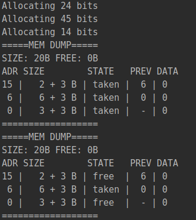

## Lab1

#### Algorithm description

Allocate:
1. Find address of the most suitable free block
2. If address is found, allocate in that block & return its address
3. Else if there is free memory in stack, create new block, return its address
4. If no free memory is left, return null

Free:
1. If block's previous or next block or both is free, merge these blocks in one and update 'previous' pointer
2. Else just clear block data and update block state as free  

#### Free block search, freeing block time

Search: O(n)
Freeing: O(1)

#### Service memory consumption rate

Block header takes 3 bytes of memory:
 * 1 byte - size
 * 1 byte - is free
 * 1 byte - previous block address

#### Advantages & disadvantages of the allocator

Advantages:
* 'the most suitable' algorithm for choosing a free block is better than 'the first' algo
*  merging blocks in one after freeing (if possible) allows save more space by minimizing space taken by headers

Disadvantages:
* depending on the situation, 'the most suitable' algorithm for choosing a free block can be not effective, due to, for example,
amount of time consumed
* depending on the situation, merging blocks after freeing memory can be too time consuming  

#### Example of work

Execution of the following code:

    const buffer = new ArrayBuffer(20);
    const allocator = new Allocator(buffer);
    const addr1 = allocator.memAlloc(24);
    const addr2 = allocator.memAlloc(45);
    const addr3 = allocator.memAlloc(14);
    allocator.memDump();
    allocator.memFree(addr3);
    allocator.memFree(addr1);
    allocator.memDump();

