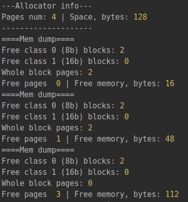

## Lab2

#### Algorithm description

Allocate:
1. If size <= half of page size 
    1. If free block of same class already exists, occupy it 
    2. Else if there are free pages, create new page with blocks of such class and occupy one block
    3. Else if this is not the biggest class, iterate from step 1 for next bigger class  
    4. Else block can not be accommodated, return null 
3. Else accommodate in whole page block
    1. If enough free pages are left, occupy them
    2. Else block can not be accommodated, return null

#### Free block search, freeing block time

Search: O(1)
Freeing: O(1)

#### Service memory consumption rate

Page description takes 5 bytes of memory:
 * 1 byte - class
 * 1 byte - first free block index
 * 1 byte - number of free blocks
 * 1 byte - index of next page
 * 1 byte - index of prev page
 
The smallest block is 8 bytes, default max description block size is 16 bytes, so page description can take 8-16 bytes.  

#### Advantages & disadvantages of the allocator

Advantages:
* quick search for free block - O(1) 
* different classes of blocks make memory consumption more effective

Disadvantages:
* partition of blocks into different classes makes search algorithm more complex and possibly harder to test maintain
 
#### Example of work

Execution of the following code:

    const buffer = new ArrayBuffer(128);
    const allocator = new PagedAllocator(buffer);
    
    const addr1 = allocator.memAlloc(8);
    const addr2 = allocator.memAlloc(16);
    const addr3 = allocator.memAlloc(PAGE_SIZE * 2);
    
    allocator.memDump();
    
    if (addr1 === null || addr2 === null || addr3 === null) throw Error('should not be null');
    
    allocator.memFree(addr1);
    allocator.memRealloc(addr2, 8);
    allocator.memDump();
    
    allocator.memFree(addr3);
    allocator.memDump();
    

