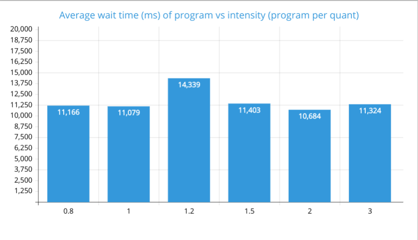
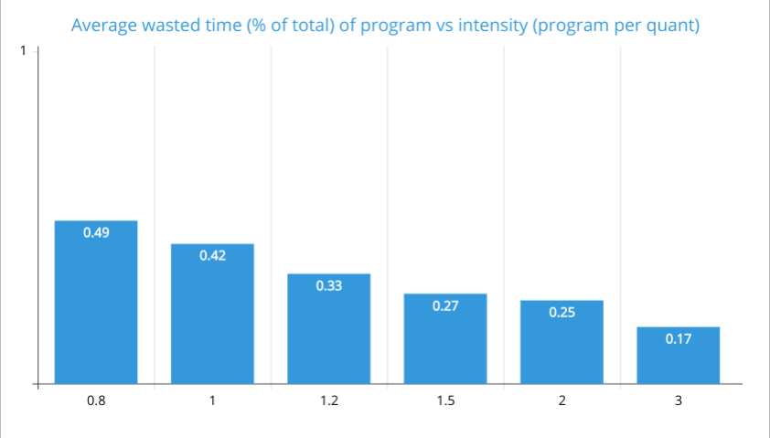

## Lab3. Змішаний алгоритм. ВП+АП

#### Опис роботи дисципліни обслуговування

Загальна робота:

1. Обирається черга, задачу з якої необхідно запустити, починаючи з першої черги:
2. Задачі цієї черги запускаються по одній, починаючи з голови черги, працюючи відповідне індексу черги число квантів. 
    1. Програми першої черги працюють максимально 3 кванти, другої - 6 разів, 3 - 20.
    2. Якщо програма завершилася за меншу кількість квантів, її виконання припиняється.
    3. Якщо програма не завершилася за відведену кількість квантів, воні переміщується у голову черги наступної за індексом (якщо це остання, 3, черга, то програма переміщується у хвіст черги).
    4. Якщо індекс даної черги не 1, після кожної ітерації задачі перевіряється, чи у першій черзі зʼявилася нова задача. 
    Якщо так, виконання переривається, перервана задача залишається у голові поточної черги, програма переходить до запуску першої черги.
3. Після 1 проходження всіх задач черги, програма переходить до наступної черги.     

Отримана програма з відповідним приблизним значенням часу роботи передається у систему обслуговування заявок і додається у першу чергу.

#### Лістинг основної частини програми.

    class TaskPlanner {
    public async run(); // поки є незавершені задачі, проходить по чергам у порядку індексів, запускаючи задачі з кожної черги, якщо вони є  
    private async runQueueCycle(qIndex: QueueIndex); // запускає цикл виконання програми, після завершення в залежності від статусу обробляє задачу 
    private async runTaskCycle(task: Task, qIndex: QueueIndex): Promise<TaskStatus> // виконує передану програму віповідну черзі кількість квантів, повертає статус програми  
    } 

#### Графіки 

Проведення замірів часу:
* для кожної величини було запущено 50 програм, результати замірів - середнє від замірів кожної програми
* час виконання програми обирався випадковим чином за формулою 5000ms + random() * 5000ms, де random() - від 0 до 1.
Таким чином, середній час виконання програми - 7500мс, тобто 12.5 квантів.
* інтенсивність потоку задач подається у кількості задач на квант часу (600мс) 

#####Залежність середнього часу очікування від інтенсивності вхідного потоку заявок

За графіком, середній час очікування рівномірно розподілений і не залежить від інтенсивності вхідного потоку задач.
Середній час очікування - 11.500мс або 19 квантів.  
 
#####Залежність відсотку часу простою ресурсу від інтенсивності вхідного потоку заявок

За графіком, середній час простою залежить від інтенсивності, причому чим більша інтенсивність, тим менший час простою. 
Значення часу простою подане у долях відсотків.

#### Достоїнства та недоліки досліджуваної дисципліни обслуговування

Достоїнства:
* рівномірний розподіл часу очікування між заявками
* оптимальний розподіл ресурсів: більш часозатратні програми не затримують виконання інших заявок

Недоліки:
* підвищена складність порівняно з іншими алгоритмами
* більше часу витрачається на  
